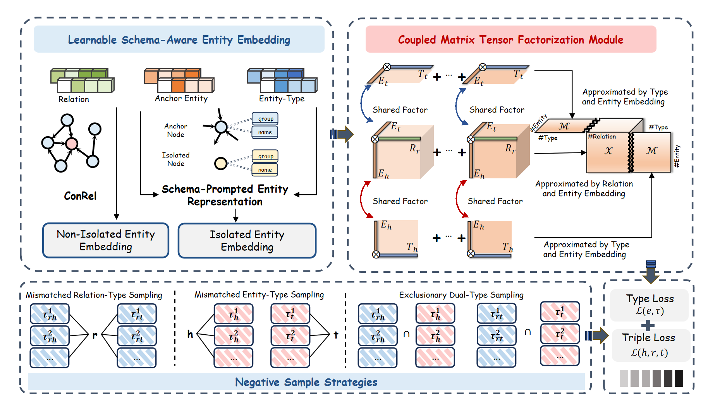

<h1 align="center">
    SchemaE
</h1>
<h3 align="center">
    Learning Schema Embeddings for Service Link Prediction: A Coupled Matrix-Tensor Factorization Approach
</h3>

In this paper, we propose a novel model that can embed entity types to improve link prediction. Additionally, we also focus on the problem of learning isolated node embeddings, which has been almost ignored in existing research. Through extensive experiments, we demonstrate the effectiveness and efficiency of our proposed model.

## Dependencies
Environmental Settings: Linux Ubuntu 20.04.6 LTS, CUDA 12.5, NVIDIA TITAN RTX(24GB).

Run `pip install -r requirements.txt` to install following dependencies:

- Python==3.11.0
- pandas==2.2.3
- scikit-learn==1.5.2
- torch==2.0.0
- numpy==1.24.1
- dgl==1.1.0+cu118
